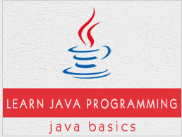

```
Roberto Nogueira  
BSd EE, MSd CE
Solution Integrator Experienced - Certified by Ericsson
```
# TutorialsPoint Java Interview Questions



**About**

Learn everything you need to about the subject of this `Tutorialspoint` project.

[Homepage](https://www.tutorialspoint.com/java/java_interview_questions.htm)

## Topics
```
[ ] What do you know about Java?
[ ] What are the supported platforms by Java Programming Language?
[ ] List any five features of Java?
[ ] Why is Java Architectural Neutral?
[ ] How Java enabled High Performance?
[ ] Why Java is considered dynamic?
[ ] What is Java Virtual Machine and how it is considered in context of Java’s platform independent feature?
[ ] List two Java IDE’s?
[ ] List some Java keywords(unlike C, C++ keywords)?
[ ] What do you mean by Object?
[ ] Define class?
[ ] What kind of variables a class can consist of?
[ ] What is a Local Variable?
[ ] What is a Instance Variable?
[ ] What is a Class Variable?
[ ] What is Singleton class?
[ ] What do you mean by Constructor?
[ ] List the three steps for creating an Object for a class?
[ ] What is the default value of byte datatype in Java?
[ ] What is the default value of float and double datatype in Java?
[ ] When a byte datatype is used?
[ ] What is a static variable?
[ ] What do you mean by Access Modifier?
[ ] What is protected access modifier?
[ ] What do you mean by synchronized Non Access Modifier?
[ ] According to Java Operator precedence, which operator is considered to be with highest precedence?
[ ] Variables used in a switch statement can be used with which datatypes?
[ ] When parseInt() method can be used?
[ ] Why is String class considered immutable?
[ ] Why is StringBuffer called mutable?
[ ] What is the difference between StringBuffer and StringBuilder class?
[ ] Which package is used for pattern matching with regular expressions?
[ ] java.util.regex consists of which classes?
[ ] What is finalize() method?
[ ] What is an Exception?
[ ] What do you mean by Checked Exceptions?
[ ] Explain Runtime Exceptions?
[ ] Which are the two subclasses under Exception class?
[ ] When throws keyword is used?
[ ] When throw keyword is used?
[ ] How finally used under Exception Handling?
[ ] What things should be kept in mind while creating your own exceptions in Java?
[ ] Define Inheritance?
[ ] When super keyword is used?
[ ] What is Polymorphism?
[ ] What is Abstraction?
[ ] What is Abstract class?
[ ] When Abstract methods are used?
[ ] What is Encapsulation?
[ ] What is the primary benefit of Encapsulation?
[ ] What is an Interface?
[ ] Give some features of Interface?
[ ] Define Packages in Java?
[ ] Why Packages are used?
[ ] What do you mean by Multithreaded program?
[ ] What are the two ways in which Thread can be created?
[ ] What is an applet?
[ ] An applet extend which class?
[ ] Explain garbage collection in Java?
[ ] Define immutable object?
[ ] Explain the usage of this() with constructors?
[ ] Explain Set Interface?
[ ] Explain TreeSet?
[ ] What is Comparable Interface?
[ ] Difference between throw and throws?
[ ] Explain the following line used under Java Program −
    public static void main (String args[ ])
[ ] Define JRE i.e. Java Runtime Environment?
[ ] What is JAR file?
[ ] What is a WAR file?
[ ] Define JIT compiler?
[ ] What is the difference between object oriented programming language and object based programming language?
[ ] What is the purpose of default constructor?
[ ] Can a constructor be made final?
[ ] What is static block?
[ ] Define composition?
[ ] What is function overloading?
[ ] What is function overriding?
[ ] Difference between Overloading and Overriding?
[ ] What is final class?
[ ] What is NullPointerException?
[ ] What are the ways in which a thread can enter the waiting state?
[ ] How does multi-threading take place on a computer with a single CPU?
[ ] What invokes a thread's run() method?
[ ] Does it matter in what order catch statements for FileNotFoundException and IOException are written?
[ ] What is the difference between yielding and sleeping?
[ ] Why Vector class is used?
[ ] How many bits are used to represent Unicode, ASCII, UTF-16, and UTF-8 characters?
[ ] What are Wrapper classes?
[ ] What is the difference between a Window and a Frame?
[ ] Which package has light weight components?
[ ] What is the difference between the paint() and repaint() methods?
[ ] What is the purpose of File class?
[ ] What is the difference between the Reader/Writer class hierarchy and the InputStream/OutputStream class hierarchy?
[ ] Which class should you use to obtain design information about an object?
[ ] What is the difference between static and non-static variables?
[ ] What is Serialization and deserialization?
[ ] What are use cases?
[ ] Explain the use of sublass in a Java program?
[ ] How to add menushortcut to menu item?
[ ] Can you write a Java class that could be used both as an applet as well as an application?
[ ] What is the difference between Swing and AWT components?
[ ] What's the difference between constructors and other methods?
[ ] Is there any limitation of using Inheritance?
[ ] When is the ArrayStoreException thrown?
[ ] Can you call one constructor from another if a class has multiple constructors?
[ ] What's the difference between the methods sleep() and wait()?
[ ] When ArithmeticException is thrown?
[ ] What is a transient variable?
[ ] What is synchronization?
[ ] What is the Collections API?
[ ] Does garbage collection guarantee that a program will not run out of memory?
[ ] The immediate superclass of the Applet class?
[ ] Which Java operator is right associative?
[ ] What is the difference between a break statement and a continue statement?
[ ] If a variable is declared as private, where may the variable be accessed?
[ ] What is the purpose of the System class?
[ ] List primitive Java types?
[ ] What is the relationship between clipping and repainting under AWT?
[ ] Which class is the immediate superclass of the Container class?
[ ] What class of exceptions are generated by the Java run-time system?
[ ] Under what conditions is an object's finalize() method invoked by the garbage collector?
[ ] How can a dead thread be restarted?
[ ] Which arithmetic operations can result in the throwing of an ArithmeticException?
[ ] Variable of the boolean type is automatically initialized as?
[ ] Can try statements be nested?
[ ] What are ClassLoaders?
[ ] What is the difference between an Interface and an Abstract class?
[ ] What will happen if static modifier is removed from the signature of the main method?
[ ] What is the default value of an object reference declared as an instance variable?
[ ] Can a top level class be private or protected?
[ ] Why do we need wrapper classes?
[ ] What is the difference between error and an exception?
[ ] Is it necessary that each try block must be followed by a catch block?
[ ] When a thread is created and started, what is its initial state?
[ ] What is the Locale class?
[ ] What are synchronized methods and synchronized statements?
[ ] What is runtime polymorphism or dynamic method dispatch?
[ ] What is Dynamic Binding(late binding)?
[ ] Can constructor be inherited?
[ ] What are the advantages of ArrayList over arrays?
[ ] Why deletion in LinkedList is fast than ArrayList?
[ ] How do you decide when to use ArrayList and LinkedList?
[ ] What is a Values Collection View ?
[ ] What is dot operator?
[ ] Where and how can you use a private constructor?
[ ] What is type casting?
[ ] Describe life cycle of thread?
[ ] What is the difference between the >> and >>> operators?
[ ] Which method of the Component class is used to set the position and size of a component?
[ ] What is the range of the short type?
[ ] What is the immediate superclass of Menu?
[ ] Does Java allow Default Arguments?
[ ] Which number is denoted by leading zero in java?
[ ] Which number is denoted by leading 0x or 0X in java?
[ ] Break statement can be used as labels in Java?
[ ] Where import statement is used in a Java program?
[ ] Explain suspend() method under Thread class>
[ ] Explain isAlive() method under Thread class?
[ ] What is currentThread()?
[ ] Explain main thread under Thread class execution?
[ ] Life cycle of an applet includes which steps?
[ ] Why is the role of init() method under applets?
[ ] Which method is called by Applet class to load an image?
[ ] Define code as an attribute of Applet?
[ ] Define canvas?
[ ] Define Network Programming?
[ ] What is a Socket?
[ ] Advantages of Java Sockets?
[ ] Disadvantages of Java Sockets?
[ ] Which class is used by server applications to obtain a port and listen for client requests?
[ ] Which class represents the socket that both the client and server use to communicate with each other?
[ ] Why Generics are used in Java?
[ ] What environment variables do I need to set on my machine in order to be able to run Java programs?
[ ] Is there any need to import java.lang package?
[ ] What is Nested top-level class?
[ ] What is Externalizable interface?
[ ] If System.exit (0); is written at the end of the try block, will the finally block still execute?
[ ] What is daemon thread?
[ ] Which method is used to create the daemon thread?
[ ] Which method must be implemented by all threads?
[ ] What is the GregorianCalendar class?
[ ] What is the SimpleTimeZone class?
[ ] What is the difference between the size and capacity of a Vector?
[ ] Can a vector contain heterogenous objects?
[ ] What is an enumeration?
[ ] What is difference between Path and Classpath?
[ ] Can a class declared as private be accessed outside it's package?
[ ] What are the restriction imposed on a static method or a static block of code?
[ ] Can an Interface extend another Interface?
[ ] Which object oriented Concept is achieved by using overloading and overriding?
[ ] What is an object's lock and which object's have locks?
[ ] What is Downcasting?
[ ] What are order of precedence and associativity and how are they used?
[ ] If a method is declared as protected, where may the method be accessed?
[ ] What is the difference between inner class and nested class?
[ ] What restrictions are placed on method overriding?
[ ] What is constructor chaining and how is it achieved in Java?
[ ] Can a double value be cast to a byte?
[ ] How does a try statement determine which catch clause should be used to handle an exception?
[ ] What will be the default values of all the elements of an array defined as an instance variable?
```
